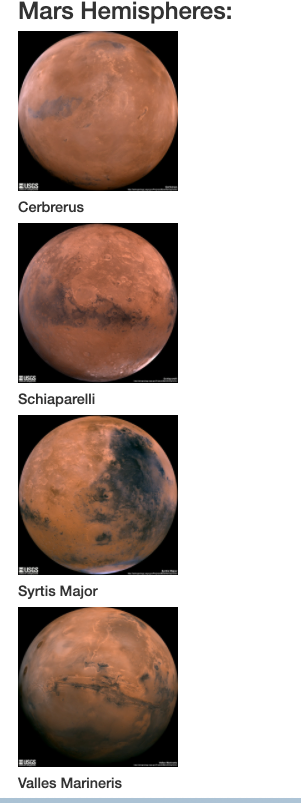

# Web Scraping Homework - Mission to Mars

This assignment builds a web application that scrapes various websites for data related to the Mission to Mars and displays the information in a single HTML page. The following outlines what was done.

## Step 1 - Scraping

Initial scraping uses Jupyter Notebook, BeautifulSoup, Pandas, and Requests/Splinter.

* Create a Jupyter Notebook file called `mission_to_mars.ipynb` and use this to complete all of your scraping and analysis tasks. The following outlines what you need to scrape.

### NASA Mars News

* Scrape the [Mars News Site](https://https://mars.nasa.gov/news/) and collect the latest News Title and Paragraph Text. 

### JPL Mars Space Images - Featured Image

* Featured Space Image site [here](https://spaceimages-mars.com).

* Use splinter to navigate the site and find the image url for the current Featured Mars Image and assign the url string.

### Mars Facts

* Visit the Mars Facts webpage [here](https://galaxyfacts-mars.com) and use Pandas to scrape the table containing facts about the planet including Diameter, Mass, etc.

* Use Pandas to convert the data to a HTML table string.

### Mars Hemispheres

* Visit the astrogeology site [here](https://marshemispheres.com/) to obtain high resolution images for each of Mar's hemispheres.

* Save both the image url string for the full resolution hemisphere image, and the Hemisphere title containing the hemisphere name. 

- - -

## Step 2 - MongoDB and Flask Application

Use MongoDB with Flask templating to create a new HTML page that displays all of the information that was scraped from the URLs above.

- - -

## Final Outcome

